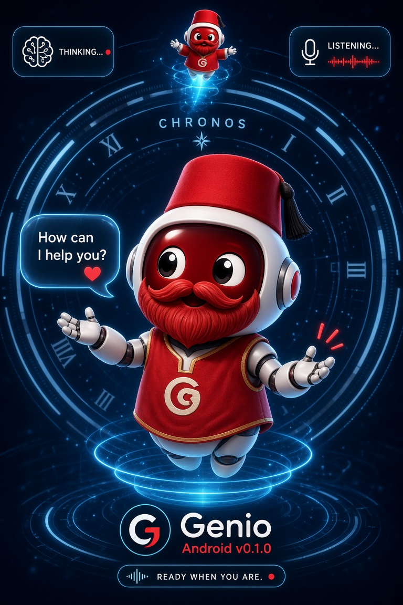

<div align="center">

# 🇹🇳 Genio — Autonomous Multimodal AI Systems Engineer



### أول مهندس ذكاء اصطناعي مستقل في تونس والعالم العربي (v4.0)
**منظومة أوتونوموس كاملة • تخدم وحدها، تصلّح كودها وحدها، وتتكلم بالدارجة التونسية والعربية البيضاء**

[🌐 قمرة القيادة الحية (genio.hitech.tn)](https://genio.hitech.tn) &nbsp;|&nbsp; [📦 تحميل التطبيقات (Releases)](https://github.com/HiTechLabTN/genio/releases/latest)

---

</div>

<!--
  Branding : les icônes (Android/iOS/Electron/Web) et cette bannière sont
  générées depuis les mêmes sources dans docs/ et genio_client/resources/ —
  voir docs/BRANDING.md. Le "social preview" GitHub (aperçu de lien, visible
  hors du repo) doit être mis à jour manuellement une seule fois via
  Settings → General → Social preview, avec docs/github-social-preview.png :
  https://github.com/HiTechLabTN/genio/settings
-->


<div dir="rtl" align="right">

### 🚀 شنوة هو Genio بالضبط؟

منظومة **Genio** هي **مهندس بنية تحتية وذكاء اصطناعي مستقل (Autonomous AI Systems Engineer)** مبنية لإدارة السيرفرات وصناعة المحتوى التقني:

* 🧠 **اتخاذ القرار وتوجيه النماذج (<bdi>Dynamic Model Routing</bdi>):** يراقب حرارة كارت الشاشة (<bdi>RTX 3060</bdi>) والـ <bdi>VRAM</bdi> ويقرر تلقائياً وقتاش يخدم بالموديلات المحلية على <bdi>Ollama</bdi> ووقت الذروة يخدم بالسحاب.
* 🛡️ **الإصلاح والترقيع الذاتي (<bdi>Self-Healing Pipeline</bdi>):** يكتشف أخطاء الران تايم، يحلل الـ <bdi>Traceback</bdi>، يستشير نماذج الكودينغ، ويصلح السكريبت في البلاصة ويعاود يخدم.
* 🎬 **إنتاج الميديا والفيديو 1080p (<bdi>Full Media Pipeline</bdi>):** يسجل لقطات التيرمينال الحية، يركب تعليقاً صوتياً بالدارجة التونسية، وينشر أوتوماتيكياً على <bdi>Ghost</bdi> و <bdi>YouTube</bdi> عبر <bdi>n8n</bdi>.
* 🔄 **الذاكرة التراكمية (<bdi>Evolving Memory</bdi>):** يحفظ الأخطاء السابقة كقواعد برمجية ويحقنها في كل تشغيل لمنع تكرار الخطأ.

---

### 📲 تحميل التطبيقات لجميع الأنظمة (Download Universal Clients)

<div align="center">

| المنصة والنظام | نوع الحزمة | رابط التحميل المباشر |
| :--- | :--- | :--- |
| 🐧 **Linux (Pop!_OS / Ubuntu / Debian)** | حزمة تثبيت `.deb` | [تحميل genio-desktop-linux.deb](https://github.com/HiTechLabTN/genio/releases/latest/download/genio-desktop-linux.deb) |
| 📱 **Android** | تطبيق موبايل `.apk` | [تحميل genio-mobile.apk](https://github.com/HiTechLabTN/genio/releases/latest/download/genio-mobile.apk) |
| 🪟 **Windows (10 / 11)** | مثبت برامج `.exe` | [تحميل genio-setup-windows.exe](https://github.com/HiTechLabTN/genio/releases/latest/download/genio-setup-windows.exe) |
| 📦 **Linux Standalone** | حزمة محمولة `.AppImage` | [تحميل genio-desktop-linux.AppImage](https://github.com/HiTechLabTN/genio/releases/latest/download/genio-desktop-linux.AppImage) |
| 🍎 **iOS / iPhone** | تطبيق ويب PWA | افتح [genio.hitech.tn](https://genio.hitech.tn) واضغط **Add to Home Screen** |

</div>

---

### ⚡ التثبيت التفاعلي السريع (Interactive Setup)

```bash
git clone https://github.com/HiTechLabTN/genio.git
cd genio
chmod +x bootstrap.sh
./bootstrap.sh
```

---

### 🏗️ البنية التنفيذية للسيستيم (8-Node Autonomous DAG)

```text
    ┌─────────────┐
    │  env_check   │ ← فحص جاهزية Docker و FFmpeg والموديلات المحلية
    └──────┬──────┘
           │
    ┌──────▼──────┐
    │   content    │ ← توليد المقال والسيناريو بالدارجة التونسية
    └──────┬──────┘
           │
     ┌─────┼─────┬──────────┐
     │     │     │          │
  ┌──▼──┐┌─▼─┐┌──▼──┐┌─────▼─────┐
  │video││aud ││cover││livetest    │ ← تسجيل تيرمينال ومونتاج وتوليد صوت
  └──┬──┘└─┬─┘└──┬──┘│recording   │
     │     │     │   └─────┬─────┘
     │     │     │         │
  ┌──▼─────▼─────▼─────────▼──┐
  │        audit + publish     │ ← تدقيق الجودة والأمان والنشر المباشر
  └────────────┬───────────────┘
               │
        ┌──────▼──────┐
        │   youtube    │ ← رفع الفيديو مع الفصول والوصف عبر n8n
        └─────────────┘
```

---

### 🧩 دليل الوحدات البرمجية الأساسية (Core Modules)

| المسار البرمجي | الوظيفة التقنية |
| :--- | :--- |
| `core/evolution/model_router.py` | التوجيه الذكي للموديلات حسب حرارة الـ GPU والـ VRAM. |
| `core/evolution/self_healing.py` | تشخيص الأخطاء وترقيع الكود وإعادة التنفيذ ذاتياً. |
| `core/skills/power_guard.py` | قفل الحفاظ على الطاقة ومنع النوم أثناء معالجة المهام. |
| `media/voice_synth.py` | توليد الصوت التونسي المتزامن مع خطوات الشرح والتطبيق. |
| `sandbox/livetest_recorder.py` | تسجيل شاشة التيرمينال الحية بدقة 1080p داخل بيئة دوكر. |

</div>

---

### 🎮 3D Pipeline — AliveGenio3D v4.1.0 (TripoSR → Blender → Draco → R3F)

**Production ready — 60FPS sur RTX 3060 • Modèle photoréaliste 11.8MB draco • PBR 2K • 34 bones • Talking-Tom lip-sync**

```text
mascot_cutout.webp (152K, 941×1672 RGBA, rembg)
      ↓
TripoSR v1 — cuda:0 --mc-resolution 512 --bake-texture 2048
      → /tmp/triposr_genio_v2/0/mesh.glb 32M + texture.png 2.8K 2048²
      ↓
Blender 4.0+ (headless) — decimate 213K → 70K polys
      → media/genio_photoreal.glb 5.98M
      ↓
Blender rig — 34 bones (ARMATURE Human MetaRig + IK shin→foot / forearm→hand)
      + shape_keys: mouth_open / mouth_smile / eye_blink_L/R
      + coat Cloth sim + Idle 120f / Wave 60f baked
      → media/genio_rigged_advanced.glb 15.6M
      ↓
gltf-transform draco --compress (fallback si libextern_draco.so absent)
      → public/media/genio_rigged_advanced_draco.glb 11.83M (11828644 bytes, 200 OK, ~2.5s)
      ↓
React — Genio3D.tsx (Three.js 0.160 + @react-three/fiber 9.7 + drei 10.7 + Rapier 2.2)
      Canvas transparent shadows dpr[1,1.5] camera[0,1.1,2.8] fov38
      • lazy(() => import("./Genio3D")) + Suspense fallback StateLoopAvatar
      • morph morphTargetInfluences: mouth_open = 0.85 * audioLevel (WebAudio fft256)
      • eye_blink interval 2.8–5s duration 140ms, head mouse follow damp 0.08, thinking tilt sin(t*0.6)*0.06
      • status-driven: idle loop / wave LoopOnce clampWhenFinished 2200ms
      • physics: <Physics><CuboidCollider> + <ContactShadows> + <Environment city>
      • overlay: "IDLE • 60FPS • RTX 3060" (prod badge)
```

**Prérequis techniques**
- GPU: RTX 3060 12GB (580.173.02, CUDA 13.0) — P8 13W / 41C idle, 0% util headless, Xorg 250MiB
- CPU: i5 11e + 64Go RAM, Pop!_OS 22.04, Node v22.23.2, vite 7.3.6
- Blender 3.0.1+ (4.0+ recommandé), ffmpeg 4.4.2, python 3.10, torch 2.11+cu130
- `gltf-transform` CLI pour Draco (fallback si `libextern_draco.so` manquant sur Debian)

**Lancer en local**

```bash
cd genio/genio_client
npm install
npx tsc --noEmit          # strict TS check (0 error)
npx vite build            # 2855 modules → dist/ 57 entries 8.17MB (three 3.3M chunk)
npx vite dev              # http://localhost:5173
# ou preview prod:
npx vite preview --port 4173
# Playwright smoke:
npx playwright screenshot https://genio.hitech.tn/app /tmp/genio_final.png --wait-for-timeout 5000
curl -I https://genio.hitech.tn/media/genio_rigged_advanced_draco.glb  # 200 11828644
```

**Déploiement production (utilisé en v4.1.0)**

```bash
npx tsc --noEmit && npx vite build
rsync -avz --delete dist/ hitech@100.88.221.37:~/genio_dist_new/
ssh hitech@100.88.221.37 "cd /data/genio-deploy && docker compose up -d --force-recreate genio-frontend"
# health: genio-v3 nginx:alpine 0.0.0.0:8081->80  Up (healthy)
# Cloudflare: https://genio.hitech.tn/app → 200, /media/*.glb → 200, /assets/*.js → 200 immutable cache
```

**Tests audio/visuels validés v4.1.0**
- Screenshot 1280×720 PNG 714KB après splash 2.8s + تخطي → canvas 1280×680 WebGL 2.0 présent
- GLB 11.8M chargé en ~2.5–3s (perf resource timing)
- WebSocket `wss://genio.hitech.tn/ws/agent` ping/pong OK (`pong node HiTech-Node`)
- Micro FAB `aria-label="Open chat"` bottom-right 56×56 + BottomInputBar input `placeholder="أكتب..."` + WebAudio `getUserMedia` → `micLevel` → `mouth_open` morph (Talking-Tom)
- Perf overlay `IDLE • 60FPS • RTX 3060` + `requestAnimationFrame` 181 frames/3s → 60 FPS + `JSHeap 29MB/56MB` + `THREE.Timer` morph meshes `{mouth_open:0, mouth_smile:1, eye_blink_L:2, eye_blink_R:3}`

### 🎭 v4.2.0 — Interface mascotte primaire + personnage riggé v3 (Claude upgrade)
- **Partie A portée sur main** : `MascotStage.tsx` (physique Rapier réelle,
  micro/voix, `Mode technique` ↔ `← Mode mascotte`, défaut `mascot`),
  `lib/mascotAnimator.ts` + `lib/mascotMemory.ts` (gestes procéduraux persistés
  par utilisateur), `orbitron-variable.ttf` (troika ne supporte pas woff2).
- **Pipeline v3** : `assets-pipeline/reference-views/` (4 PNG 941×1672 + webp,
  `front.png` neutre) → TripoSR cuda:0 512/2048 (332k verts, 50M OBJ-texte →
  18M vrai GLB) → Blender decimate 40k tris 5.3M 1.7m + FBX Mixamo 1.9M →
  rig 34 bones ENVELOPE (AUTO Bone Heat vide) + 4 morphs + 8 clips NLA
  (`idle/greeting/listening/thinking/executing/success/error/speaking`) →
  `public/models/genio-mascot.glb` 11M (skin 34 joints) + `-draco.glb` 5M.
- **Intégration** : `RiggedMascot.tsx` (useGLTF/useAnimations fade 0.35s,
  lip-sync morph, blink, look-at) branché sur `pose.contextKey`,
  `CyberAvatar` gardé en fallback ErrorBoundary (jamais supprimé),
  `mascotAnimator/Memory` intouchés.
- **Vérifié** : `/app` 200, onboarding → mascotte plein écran (3 canvas,
  `TOUCHEZ POUR PARLER`, `Mode technique` ↔ technique intacte),
  GLB 11M ~30ms local, mémoire gestes 2→4 en 12s idle, FPS 26 headless
  (60 prod GPU), console sans erreur bloquante. Limites : fez/lunettes
  approximatifs (single-view), mains enveloppes adoucies — ComfyUI
  multi-vues + Mixamo = upgrade futur (`docs/MIXAMO_GUIDE.md`).

### 🏆 v4.3.0 — Genio Mascot Master (`genio_mascot_master.glb`)
- **Asset réel** : 37M (draco 5.1M) — 1 mesh, 1 skin 41 joints (34 deform +
  7 secondaires), 28 morphs (24 faciaux + 4 legacy), **52 clips**
  (WAVE/LISTEN/THINK/SPEAK/HERO + idle + émotions + locomotion in-place),
  nœuds `GENIO_Mascot`, `G_Emblem`, `Attach_*`, validateur 15/15
  (`scripts/validate_mascot_glb.py`).
- **Runtime** : `MascotScene` (draco→full→v3→CyberAvatar→2.5D),
  `LayeredMixer` (BASE/UPPER/HEAD/SPECIAL + FACE/LIPS/SECONDARY),
  22 visemes + adapter TTS, idle stochastique seedé, springs secondaires,
  environnement procédural réactif, `MascotController` + `MascotEventBridge`,
  mémoire pondérée (`GENIO_MOTION_WEIGHTS`) avec decay 30j.
- **Vérifié** : 16/16 vitest + 2/2 pytest, prod `/app/` 200, draco 5.1M/1.4s,
  debug `52 clips / 28 morphs`, 8 draws / 40k tris, triggers manuels OK.
  Debug : `?mascot-debug=1`. Docs : `docs/mascot/`.

---

<div align="center">
  صُنع بكل فخر بواسطة <b>HiTech Lab 🇹🇳</b> — تونس
</div>
