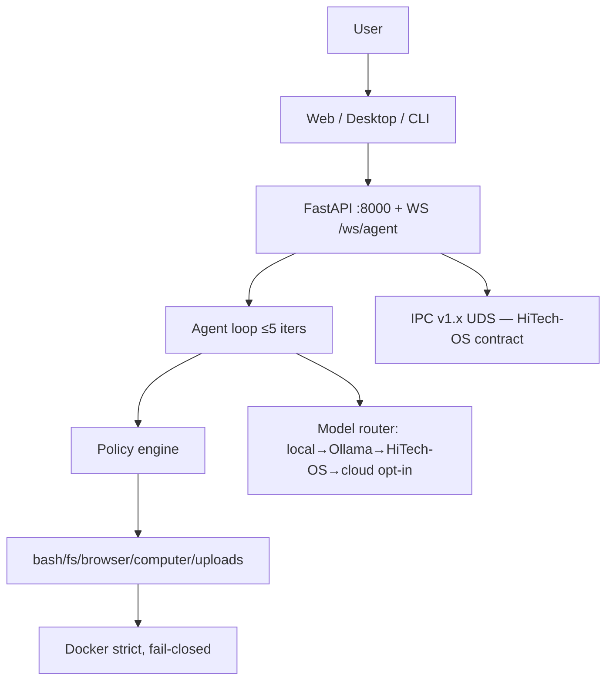

# 🇹🇳 Genio — Sovereign Tunisian AI Agent Runtime

> **المهندس المستقل: في دارك، تحت يدك، وبسيادتك الكاملة.**
> *The independent engineer: in your home, under your hand, under your full sovereignty.*

[](https://github.com/HiTechLabTN/genio/releases/tag/v5.0.0)
[](https://github.com/HiTechLabTN/genio/actions)
[](docs/SECURITY.md)
[](LICENSE)

**Genio is a sovereign, local-first AI agent runtime from Tunisia.** It understands Tunisian Darija, executes multi-step tasks through
gated tools, and never sends your data to the cloud unless you explicitly allow it.

**👋 Just exploring** · [🚀 Try](#-try-genio) · [📦 Install](#-install-genio) · [🧑‍💻 Developer](#-developer) · [🔐 Security](#-security) · [🏗️ Architecture](#️-architecture)

---

## 🚀 Try Genio

**👉 https://genio.hitech.tn** — open it, press *Try Genio*, start chatting in Darija, French or English.

What happens: the web app connects over WebSocket to a Genio backend. No account, no API key in the browser.
If the backend is unreachable you get an honest offline/degraded state — never a fake "connected".

## ✨ What is Genio?

For **non-technical visitors**: Genio is a smart assistant that lives on your own computer or server. You talk to it,
it does computer work for you (files, code, analysis, automation) — and your data stays home.

For **technical visitors**: an autonomous agent loop (≤5 iterations, budgets enforced) over a capability registry,
central policy engine (ALLOW/DENY/ESCALATE), container sandbox (fail-closed), model router
(local → Ollama → HiTech-OS → explicit cloud opt-in), session memory, and a WebSocket API.

## 🧠 What can Genio do?

| Capability | Status | Evidence |
|---|---|---|
| Chat (Darija/FR/EN) | Available | app + `/ws/agent` |
| Multi-step tasks | Available | agent loop, budgets |
| Bash / filesystem tools | Available | AST validation, realpath boundary |
| Browser (anti-SSRF) | Available | private-IP/DNS-rebinding blocks |
| Sandboxed execution | Available | Docker strict, HOST_EXECUTION=0 |
| Memory | Available | session recall + poisoning guards |
| Voice (STT/TTS) | Limited | faster-whisper + VODER; `ar` via `auto`, explicit 422 otherwise |
| HTTP API (14 routes) | Available | `schemas/openapi-genio.json` |
| IPC v1.x (HiTech-OS) | Available | contract + reference client (daemon impl. pending OS-side) |
| Docker | Available | `ghcr.io/hitechlabtn/genio:5.0.0`, non-root |
| Desktop app (Linux) | Available | AppImage + DEB in v5.0.0 release |
| Windows / macOS / Android / iOS | **Not available** | no toolchain/signing here |
| Production-signed binaries | **No** | UNSIGNED/DEVELOPMENT, SHA-256 instead |

## 🎯 Real-world examples

**You ask** (in Darija): *«شنوّة الملفات الكبيرة في المشروع هذا؟»*
**Genio can**: inspect the workspace with bounded filesystem tools inside the sandbox.
**What you see**: steps, tool calls, result — and the exact limits if something is denied.

**You ask**: *«Serveur, est-ce que tout va bien ?»*
**Genio can**: report CPU/RAM/GPU/telemetry, check service health, propose (never execute silently) repairs.
**What you see**: metrics labeled with their source; `Unavailable` where a metric doesn't exist — never `0`.

## 🖥️ See Genio in action

Live product portal: https://genio.hitech.tn (Explore · Security · API · Docs · Download · Install).

Screenshots (real captures, unedited): `docs/audit/evidence/` and `promt/qa-evidence/`.

## 📦 Install Genio

**Linux AppImage / DEB / Docker / source archive** — full commands with checksums:
👉 **[Download Center](https://genio.hitech.tn/download)** · 👉 [v5.0.0 release](https://github.com/HiTechLabTN/genio/releases/tag/v5.0.0)

Install in 3 steps (archive path):

```bash
curl -fsSL -o genio.tar.gz https://github.com/HiTechLabTN/genio/releases/download/v5.0.0/genio-5.0.0.tar.gz
curl -fsSL -o genio.tar.gz.sha256 https://github.com/HiTechLabTN/genio/releases/download/v5.0.0/genio-5.0.0.tar.gz.sha256
sha256sum -c genio.tar.gz.sha256 && tar xzf genio-5.0.0.tar.gz
```

Then with the CLI installer (`installer/genio`): `install --prefix … --yes` → `doctor --deep`.

Verify success looks like:

```
verdict: HEALTHY (0 FAIL)
{"status":"ok","service":"genio-core","version":"3.1.2"}   # GET /health
```

- `genio doctor` — full health (exit 17 on any FAIL)
- `genio status` — manifest + detected traces
- `genio version` — installer version
- Uninstall: `genio uninstall --prefix …` (keeps `data/`; `--purge-data` needs typed `PURGE`)
- Trouble dans: `docs/install/TROUBLESHOOTING.md`

## 🩺 Security (summary)

Fail-closed sandbox · strict boot guard (`prod`/`strict` refuse keyless start) · short-lived Bearer + rate limits ·
SSRF/filesystem/upload/injection guards · scrubbed telemetry · preemptive kill switch · Tauri scopes
(fs `$CACHE`-only, 3 official HTTP origins, shell `open()` only).
Full model: [docs/SECURITY.md](docs/SECURITY.md) · boundary: [docs/security/SECURITY_BOUNDARY.md](docs/security/SECURITY_BOUNDARY.md) ·
privacy: [docs/security/PRIVACY.md](docs/security/PRIVACY.md).

## 🏗️ Architecture


```mermaid
flowchart TD
    User --> UI[Web / Desktop / CLI]
    UI --> API[FastAPI :8000 + WS /ws/agent]
    API --> Loop[Agent loop ≤5 iters]
    Loop --> Policy[Policy engine]
    Policy --> Tools[bash/fs/browser/computer/uploads]
    Tools --> Sandbox[Docker strict, fail-closed]
    Loop --> Router[Model router: local→Ollama→HiTech-OS→cloud opt-in]
    API --> IPC[IPC v1.x UDS — HiTech-OS contract]
```

Details: [docs/ARCHITECTURE.md](docs/ARCHITECTURE.md) · [docs/architecture/STANDALONE_ARCHITECTURE.md](docs/architecture/STANDALONE_ARCHITECTURE.md).

## 🔌 API / IPC

- HTTP: `schemas/openapi-genio.json` (17 paths) · live explorer: https://genio.hitech.tn/api
- IPC: `docs/ipc/IPC_V1.md` + `schemas/ipc-v1.json` (hello/capabilities/infer, error codes, events)

## 🖥️ Platform support

| Platform | Status |
|---|---|
| Linux (AppImage/DEB/archive/Docker/CLI) | ✅ Available (v5.0.0) |
| Windows / macOS / Android / iOS | ❌ Not available (toolchains/signing external) |
| HiTech-OS daemon integration | Contract ready, implementation pending (OS side) |

## 📚 Documentation

- [Getting Started](docs/install/INSTALLATION.md) · [Production install](docs/install/PRODUCTION_INSTALLATION.md)
- [Recovery](docs/install/RECOVERY.md) · [Upgrade & rollback](docs/install/UPGRADE_AND_ROLLBACK.md) · [Troubleshooting](docs/install/TROUBLESHOOTING.md)
- [API](docs/API.md) · [IPC v1](docs/ipc/IPC_V1.md) · [Security](docs/SECURITY.md) · [Architecture](docs/ARCHITECTURE.md)
- [Limitations](docs/releases/GENIO_5_LIMITATIONS.md) · [Release notes](docs/release/RELEASE_NOTES_4.1.0.md) · [Migration](docs/releases/GENIO_5_MIGRATION.md)

## ❓ FAQ

- **What is Genio?** A local-first AI agent runtime (above).
- **Is it free/open source?** Apache-2.0 ([LICENSE](LICENSE)).
- **Where does it run?** Your Linux machine/server, Docker, or Linux desktop app.
- **Does it require HiTech-OS?** No — standalone by design; IPC contract ready for future integration.
- **Can I use it without HiTech-OS?** Yes, fully.
- **Is Docker supported?** Yes (`ghcr.io/hitechlabtn/genio:5.0.0`).
- **Windows/macOS/Android?** Not available (see matrix).
- **Is it signed?** No — UNSIGNED/DEVELOPMENT; verify SHA-256 checksums.
- **How do I uninstall?** `genio uninstall --prefix …` (data preserved unless `--purge-data`).
- **Report security issues?** Open a GitHub issue (do not post secrets); see [SECURITY.md](docs/SECURITY.md).

## ⚠️ Limitations

Short version: no signed binaries · no Win/Mac/mobile builds · HiTech-OS daemon pending · voice VRAM contention ·
visual notification rendering unverified · PWA tasks need backend. Full list:
[docs/releases/GENIO_5_LIMITATIONS.md](docs/releases/GENIO_5_LIMITATIONS.md).

## 🧑‍💻 Developer

```bash
git clone https://github.com/HiTechLabTN/genio.git
python3 -m pytest tests/ -q            # backend + security suites
cd genio_client && npm ci && npm run build
python3 installer/genio doctor
```

Contracts: product/canonical/platform in `docs/audit/GENIO_5_*_CONTRACT.md`. CI: 6 jobs, all blocking.

## 🤝 Contributing

Open an issue or pull request on GitHub. CI must stay green; no masked failures; no secrets in commits;
tests required for behavior changes. Be kind, write Derja/French/English as you like.

## 📜 License

Apache-2.0 — see [LICENSE](LICENSE). فخر الصناعة البرمجية التونسية المستقلة 🇹🇳 — HiTechLab
